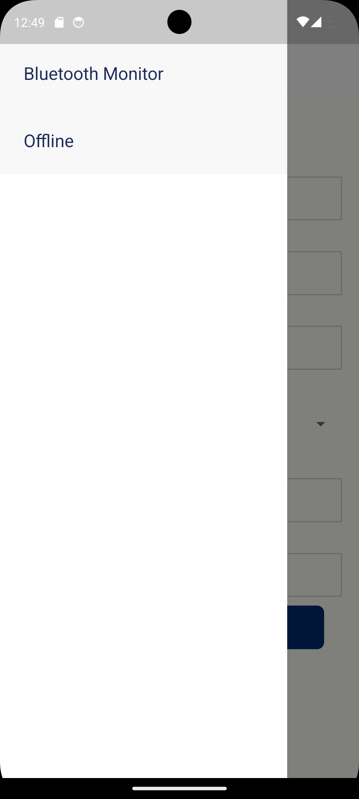
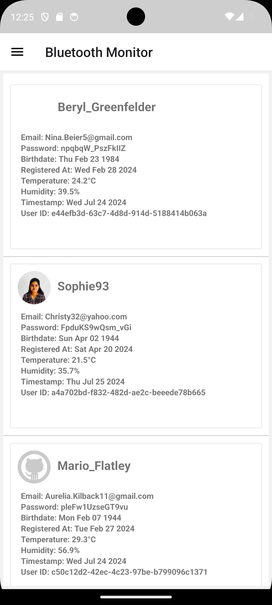
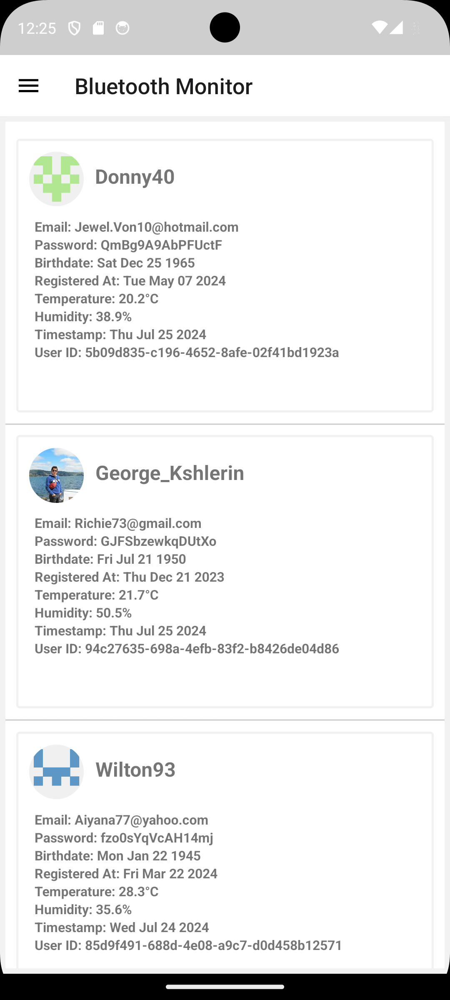
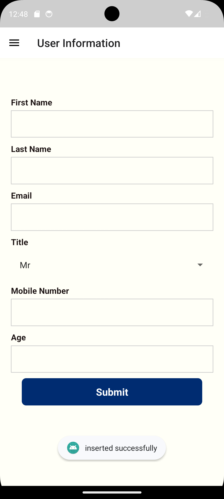

# Project Name
BluetoothApp


## Description
BluetoothApp provides connecting to a Bluetooth device and reading random numerical data from the Bluetooth device and displaying it in the app. Ensure the app can store this data locally when offline and sync it to a cloud service when connectivity is restored.

## Technologies Used
- React Native
- @faker-js/faker
- Realm

## Installation
### Prerequisites
- Node.js
- npm
- React Native CLI

### Setup
## Step 1: Start the Metro Server
```bash
git clone https://github.com/mahes-waran/BluetoothApp.git
cd BluetoothApp
npm install
# using npm
npm start

# OR using Yarn
yarn start
```

## Step 2: Start BluetoothApp
### For Android

```bash
# using npm
npm run android

# OR using Yarn
yarn android
```

### For iOS

```bash
# using npm
npm run ios

# OR using Yarn
yarn ios
```

## Project Structure
```bash
├── android
├── ios
├── src
    ├── assets
│   ├── components
│   ├── container
│   ├── database
│   ├── hooks
│   └── lib
├── App.tsx
├── package.json
└── README.md
```

## Features
- Scan Bluetooth Devices
- Display Heart Rate
- Automatic Data Sync Offline into Online
- Offline Mode

## Usage:
# ScreenShot

    

### Contributing
Umamaheswaran K


# Testing
```bash
npm test
```

# Learn More

To learn more about React Native, take a look at the following resources:

- [React Native Website](https://reactnative.dev) - learn more about React Native.
- [Getting Started](https://reactnative.dev/docs/environment-setup) - an **overview** of React Native and how setup your environment.
- [Learn the Basics](https://reactnative.dev/docs/getting-started) - a **guided tour** of the React Native **basics**.
- [Blog](https://reactnative.dev/blog) - read the latest official React Native **Blog** posts.
- [`@facebook/react-native`](https://github.com/facebook/react-native) - the Open Source; GitHub **repository** for React Native.
